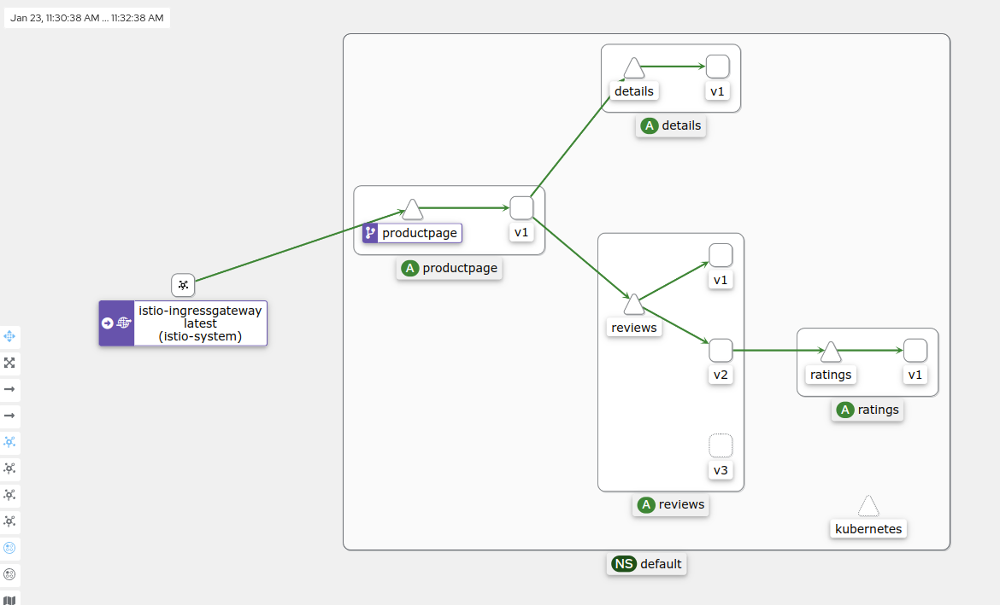

This example deploys a sample application composed of four separate microservices used to demonstrate various Istio features.

The Bookinfo application is broken into four separate microservices:

    productpage. The productpage microservice calls the details and reviews microservices to populate the page.
    details. The details microservice contains book information.
    reviews. The reviews microservice contains book reviews. It also calls the ratings microservice.
    ratings. The ratings microservice contains book ranking information that accompanies a book review.

1. `curl -L https://istio.io/downloadIstio | sh -`
2. `cd istio-1.16.1`
3. `cd bin`
4. `export PATH=$PWD/bin:$PATH`
5. `source ~/.bashrc` 
6. `istioctl install --set profile=demo -y`
7. `kubectl label namespace default istio-injection=enabled`
8. `kubectl apply -f bookinfo.yaml`
9. `kubectl apply -f bookinfo-gateway.yaml`
10. `minikube tunnel`
11. `export GATEWAY_URL=$INGRESS_HOST:$INGRESS_PORT`
12. `kubectl apply -f /addons`
13. `kubectl rollout status deployment/kiali -n istio-system`
14. `istioctl dashboard kiali`

